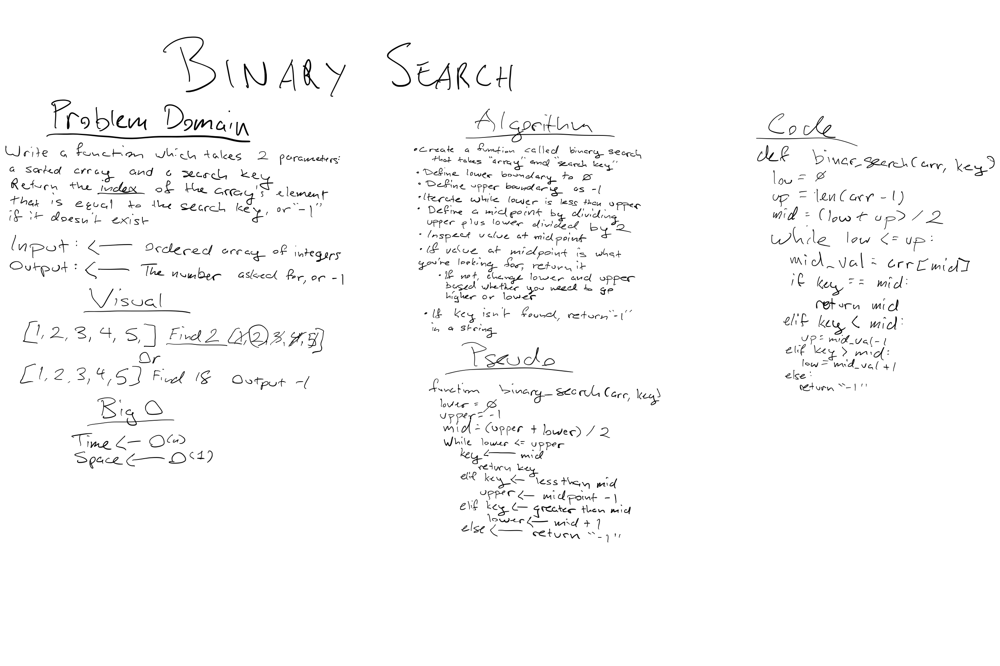

# Challenge Summary
- Write a function called **BinarySearch** which:
-  takes in 2 parameters: 
   -  a sorted array and, 
   -  the search key 
- Without utilizing any of the built-in methods available to your language:
- return the index of the array’s element that is equal to the search key, 
  - Input: [4,8,15,16,23,42], 15
  - Output: 2
- or -1 if the element does not exist.
  - Input: [11,22,33,44,55,66,77], 90
  - Output: -1

NOTE: The search algorithm used in your function should be a binary search.

## Approach & Efficiency
- I went with storing the first and last half of the list in separate variables and adding them together and dividing them by two is the variable for finding the middle point.
- I'll use a while loop to iterate through both halves starting from the middle. 
- If the number is greater than the middle number, or less than the middle number my conditions will check both halves and return the value searched for
- If it's not there I'll return -1

Big O of time is O(n) and space is O(1)

## Solution

[Python Table of Contents](../README.md)
