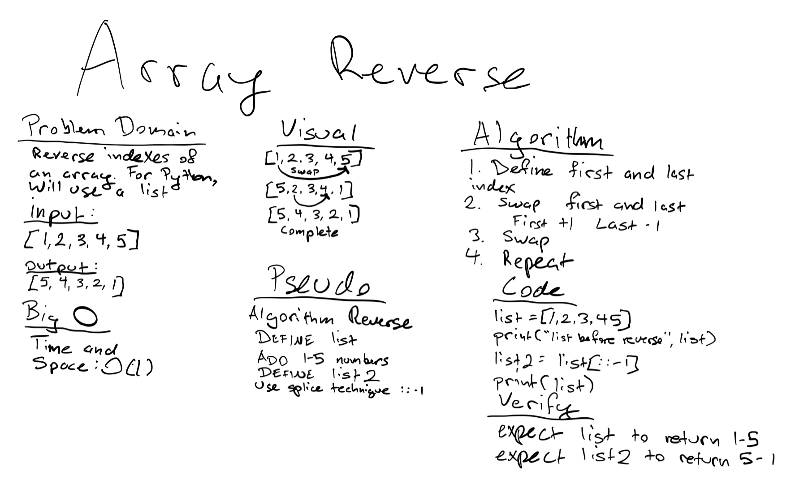

# Reverse an Array

Write an algorithm that takes the order of the input and outputs the input in reverse order

## Challenge

Using python, create an input of integers and return the output in reverse of the input

## Approach & Efficiency

I decided to go with a python list
- One list will take the input ```[1, 2, 3, 4, 5]``` 
- The second list will take the input and return the output in reverse ```[5, 4, 3, 2, 1]```
- Big O for time/space will both be O(1) as this is a constant algorithm with no loops.

## Solution



- [Coded Solution](array_reverse.py)
- [Python Table of Contents](../README.md)

