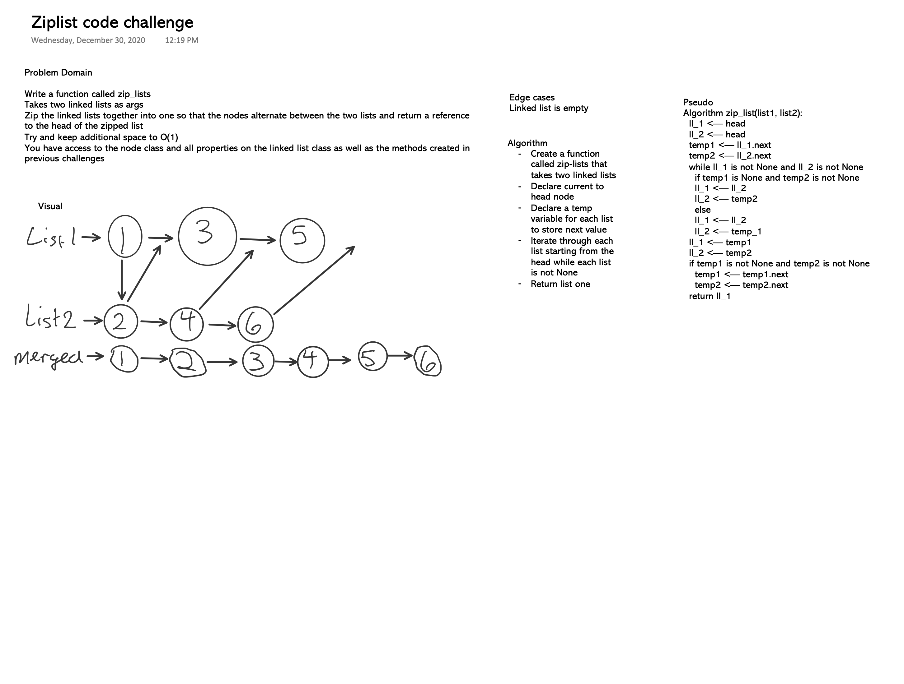

[Table of Contents](../README.md)
[View code here](ll_zip.py)

## Code Challenge 08 Description
- Write a function called zipLists which takes two linked lists as arguments. 
- Zip the two linked lists together into one so that the nodes alternate between the two lists and return a reference to the head of the zipped list. 
- Try and keep additional space down to O(1). 
- You have access to the Node class and all the properties on the Linked List class as well as the methods created in previous challenges.

Example:
```
zip_lists(list1, list2):
- Arg list1		
head -> [1] -> [3] -> [2] -> X	
head -> [5] -> [9] -> [4] -> X	
head -> [1] -> [5] -> [3] -> [9] -> [2] -> [4] -> X
- Arg list2
head -> [1] -> [3] -> X	
head -> [5] -> [9] -> [4] -> X	
head -> [1] -> [5] -> [3] -> [9] -> [4] -> X

- Output
head -> [1] -> [3] -> [2] -> X	
head -> [5] -> [9] -> X	
head -> [1] -> [5] -> [3] -> [9] -> [2] -> X
```
## Approach & Efficiency
I firstly opted to name the function merge_lists as it made more sense to me as that is what "zip" is doing anyway. I didn't want to confuse myself getting caught up in naming. 
- list_1's head value will be pointing to list_2's head value
- list_2's head value will be pointing toward list_1's next value 
- I'm going to use a temp_1 and temp_2 to store the values of list_1 and list_2's next value
- Big O Time: O(1)
- Big O Space: O(1)

## Whiteboard


