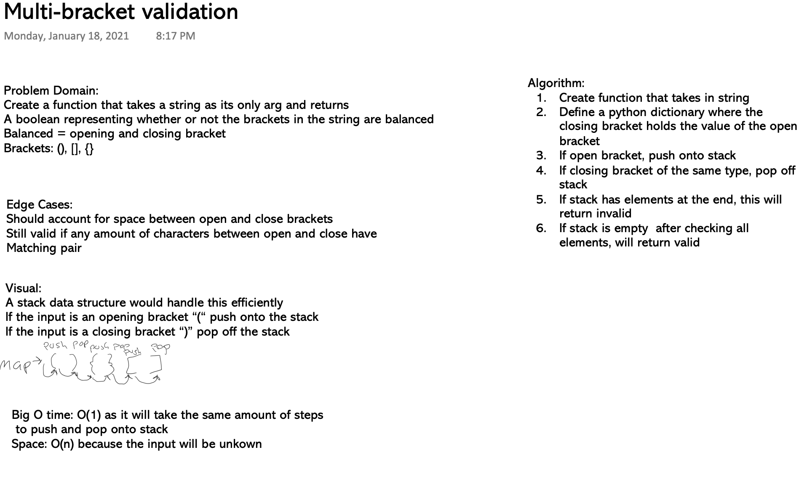

# Challenge Summary
Multi-bracket Validation.

## Challenge Description
- Create a function called multi_bracket_validation(input)
  - Your function should take a string as its only argument, and 
  - should return a boolean representing whether or not the brackets in the string are balanced. 
  - There are 3 types of brackets:
    - Round Brackets : ()
    - Square Brackets : []
    - Curly Brackets : {}

## Approach & Efficiency
Implement using stack data structure.
- Big O time: O(1)
- Big O space: O(n)

## Solution
